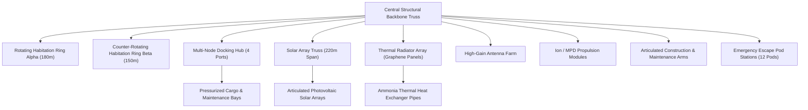

# Engineering Specification: Aethelguard AAA Orbital Research Megastation

## 1. Executive Summary & Mission Purpose

The **Aethelguard Megastation** is a next-generation deep-space orbital research facility designed to serve as a primary science hub, vessel refueling depot, and long-duration life support station in low Earth orbit. The facility is designed to support 150 permanent crew members, high-energy particle physics research, and autonomous deep-space vessel construction.

---

## 2. Key Dimensions & Physical Characteristics

- **Overall Length**: $450.0 \text{ meters}$
- **Primary Habitation Ring Outer Diameter**: $180.0 \text{ meters}$
- **Counter-Rotating Ring Diameter**: $150.0 \text{ meters}$
- **Solar Array Total Span**: $220.0 \text{ meters}$
- **Primary Truss Diameter**: $15.0 \text{ meters}$
- **Total Station Mass**: $2,850,000 \text{ kg}$
- **Design Lifespan**: $75 \text{ years}$

---

## 3. Subsystem Architecture & Engineering Layout

### 3.1 Central Structural Backbone Truss
Constructed from carbon-titanium composite lattice trusses, providing structural rigidity against tidal forces, docking impacts, and rotation torque.

### 3.2 Dual Counter-Rotating Habitation Rings
- **Alpha Ring (180m)**: Rotates at $1.95 \text{ RPM}$ to produce $0.38\text{g}$ (Martian equivalent gravity) for crew quarters, medical facilities, and hydroponic gardens.
- **Beta Ring (150m)**: Counter-rotates to cancel gyroscopic precession and maintain zero angular momentum drift on the main station axis.

### 3.3 Articulated Photovoltaic Solar Arrays
Dual-axis sun-tracking solar arrays spanning $220\text{m}$, generating $4.2 \text{ MW}$ of continuous power. Photovoltaic cells feature anti-reflective sapphire coatings and micro-meteoroid protective shielding.

### 3.4 Thermal Rejection Radiators
High-efficiency graphene thermal radiator panels utilizing liquid ammonia loop heat pipes to reject up to $3.5 \text{ MW}$ of waste heat into cold space.

### 3.5 Multi-Node Orbital Docking Hub
Features 4 APAS-95 compatible pressurized docking ports for crew transports, 2 unpressurized cargo berths for container ships, and automated fueling umbilical booms.

### 3.6 Communication & Sensor Array Farm
Consists of 3 high-gain parabolic dish antennas, phased-array laser communications for deep-space telemetry, and long-range orbital radar modules.

---

## 4. Materials & Surface Engineering

| Component | Primary Material | Coating / Surface Finish | Thermal / Structural Role |
| :--- | :--- | :--- | :--- |
| Main Truss | Carbon-Titanium Composite | Anodized Black Matte | High stiffness-to-weight structural skeleton |
| Habitation Rings | Reinforced Al-Li Alloy 2195 | White Multi-Layer Insulation (MLI) | Thermal management & pressure containment |
| Solar Arrays | Ultra-Thin Silicon / Perovskite | Sapphire Protective Glass | Photovoltaic energy conversion |
| Thermal Radiators | Graphene Sheet / Carbon Fiber | High-Emissivity Carbon Black | Infrared heat radiation into vacuum |
| Docking Ports | High-Strength Titanium Grade 5 | Machined Polished Steel | Impact resistance & airlock seal integrity |
| Windows & Decks | Laminated Quartz / Sapphire | Anti-Reflective UV Coating | Radiation shielding & observation transparency |
